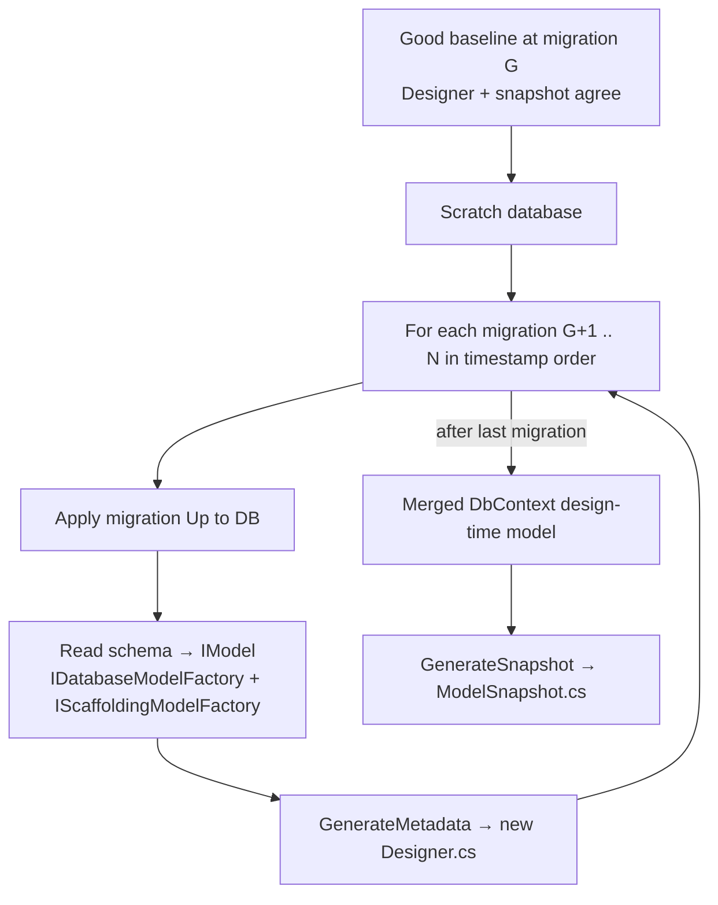
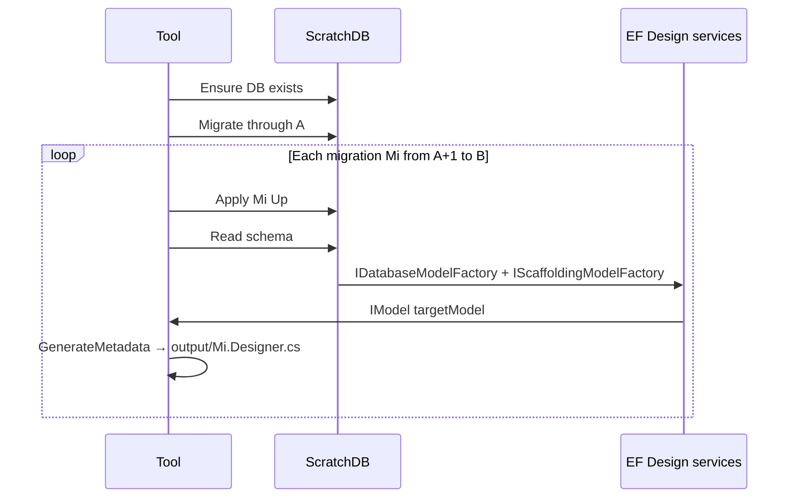

# Recovering out-of-sync migration Designer & snapshot files

Team workflow guide for when parallel `dotnet ef migrations add` work leaves `*ModelSnapshot.cs` and `.Designer.cs` files inconsistent after integration — while migration `.cs` files (Up/Down) remain correct.

See also: [migration-study-guide.md](migration-study-guide.md) for a conceptual introduction to migration files, snapshots, and merge pitfalls. See [migration-generation.md](migration-generation.md) for how EF Core generates these files in the first place.

---

## Problem summary

| Usually still good | Usually broken after parallel merges |
|--------------------|-------------------------------------|
| Merged `DbContext` (final schema in code) | `*ModelSnapshot.cs` |
| `{MigrationId}.cs` (Up/Down) per engineer | `{MigrationId}.Designer.cs` after the merge point |
| One known-good baseline: `{G}.Designer.cs` + snapshot matching migration **G** | Snapshot / designers from conflicting branches |

**G** = last migration where snapshot and Designer still agree and match the database state you trust.

---

## Why this happens (not a git bug)

Each `migrations add`:

1. Diffs current `DbContext` against the **single** model snapshot.
2. Writes a new `{Id}.cs` + `{Id}.Designer.cs`.
3. **Rewrites** the entire `*ModelSnapshot.cs`.

When six engineers add migrations on different branches, each branch has a full snapshot at its tip. Merging two branches merges two incompatible full models. Git cannot produce a valid snapshot; manual conflict resolution almost never does either.

Microsoft’s documented approach: [Managing migrations conflicts](https://aka.ms/efcore-docs-migrations-conflicts) — linearize by keeping one branch’s migration chain and re-adding the other’s schema changes on top.

This document describes a **non-git recovery**: keep all good `.cs` files and **recompute** Designer + snapshot metadata.

---

## EF Core constraints (what the product can and cannot do)

### No built-in “regenerate metadata” command

There is no public CLI such as `dotnet ef migrations regenerate-metadata`.

Designer and snapshot **source text** is produced only from an **`IModel`**, via:

| Output | API | Source file |
|--------|-----|-------------|
| `.Designer.cs` | `IMigrationsCodeGenerator.GenerateMetadata` | `src/EFCore.Design/Migrations/Design/CSharpMigrationsGenerator.cs` |
| `*ModelSnapshot.cs` | `IMigrationsCodeGenerator.GenerateSnapshot` | same |
| Model body inside both | `ICSharpSnapshotGenerator.Generate` | `src/EFCore.Design/Migrations/Design/CSharpSnapshotGenerator.cs` |

Orchestration for `migrations add`: `MigrationsScaffolder` in `src/EFCore.Design/Migrations/Design/MigrationsScaffolder.cs`.

### Up operations ≠ target model

| Data | Comes from |
|------|------------|
| `Migration.UpOperations` | `{Id}.cs` — `Up(MigrationBuilder)` |
| `Migration.TargetModel` | `{Id}.Designer.cs` — `BuildTargetModel(ModelBuilder)` |

The migrator passes `TargetModel` into SQL generation when applying migrations (`Migrator.GenerateUpSql` in `src/EFCore.Relational/Migrations/Internal/Migrator.cs`). Incorrect Designer files can affect generated SQL even when `Up()` looks correct.

### No operations → model API

`MigrationsModelDiffer` maps **model → operations**, not **operations → model**. You cannot reliably derive each migration’s target model from `{good designer at G} + {migration.cs}` alone without another source of truth (database or `DbContext`).

---

## Recovery pipeline (recommended)

Use a **throwaway database** and the same design-time services EF uses for scaffolding.



### Step 0 — Linearize and validate the `.cs` chain

1. Sort migrations by id timestamp (`yyyyMMddHHmmss_Name`).
2. Confirm a **single** ordered list (no duplicate ids, no parallel tips).
3. From **G** onward, verify each `.cs` is valid for the schema left by the previous migration (review or apply to scratch DB).

### Step 1 — Database state at **G**

On a disposable database (LocalDB, Docker SQL Server, etc.):

- Restore a backup from after **G** was applied, **or**
- `dotnet ef database update G` using migrations `<= G` where metadata for `<= G` is still good.

### Step 2 — Regenerate each `.Designer.cs` (G+1 through N)

For each migration `Mi` in order:

1. Apply `Mi` to the scratch database (`dotnet ef database update Mi` once prior designers are fixed, or execute `Up` directly).
2. Build `IModel` from the live database (reverse-engineering stack):
   - `IDatabaseModelFactory.Create(...)`
   - `IScaffoldingModelFactory.Create(databaseModel, ...)`
   - `IModelRuntimeInitializer.Initialize(..., designTime: true)`
3. Call `GenerateMetadata(namespace, contextType, migrationName, migrationId, targetModel)` and write `{Mi}.Designer.cs`.

**Note:** Only the **last** migration’s target model should match the merged `DbContext`. Intermediate designers intentionally represent schema at that point in history.

### Step 3 — Regenerate the snapshot

From the merged `DbContext` design-time model (or from the scratch DB after all migrations are applied):

```csharp
// Pseudocode — design-time services, same as MigrationsScaffolder
var model = designTimeModel.Model;
var code = codeGenerator.GenerateSnapshot(
    snapshotNamespace,
    contextType,
    snapshotName,
    model,
    latestMigrationId: lastMigrationInChain);
```

Overwrite `*ModelSnapshot.cs`. `LastMigrationId` must be the final migration id in the linear chain.

### Step 4 — Validate

**Per migration** after **G**:

```csharp
var prev = migrations[i - 1].TargetModel;
var curr = migrations[i].TargetModel;
var expectedOps = migrations[i].UpOperations;
var actualOps = differ.GetDifferences(
    prev.GetRelationalModel(),
    curr.GetRelationalModel());
// Assert actualOps is equivalent to expectedOps
```

**End state:**

```bash
dotnet ef migrations has-pending-model-changes
```

Should report **no** pending changes when `DbContext` matches the final schema.

Reference test pattern: `SnapshotModelProcessorTest.AssertSameSnapshot` in `test/EFCore.Design.Tests/Migrations/Design/SnapshotModelProcessorTest.cs` (compares snapshot model to `IDesignTimeModel` via `IMigrationsModelDiffer`).

---

## Simpler variant (higher risk)

If you never revert past intermediate migrations and do not rely on `TargetModel` for old steps:

- Regenerate **only** the last migration’s `.Designer.cs` from merged `DbContext`.
- Regenerate **snapshot** from merged `DbContext`.
- Leave older `.Designer.cs` files unchanged.

**Risk:** `GenerateUpSql` / `GenerateDownSql` use `TargetModel`; stale intermediate designers can skew SQL for those migrations.

For active teams applying migrations across environments, use the **full pipeline** above.

---

## What does not work

| Approach | Why it fails |
|----------|----------------|
| Manually merge snapshot/Designer in git | Each file encodes a **full** model; merged `BuildModel` / `BuildTargetModel` is invalid |
| Regenerate Designer from `.cs` `Up()` only | No API to apply `MigrationOperation` list → `IModel` |
| Empty migration only (`migrations add` with no ops) | Fixes snapshot **format / EF version** drift when model already matches; does not fix parallel branch merges |
| Use final `DbContext` for **every** Designer | Wrong for `G+1 .. N-1`; only the last migration’s target equals the final context |

---

## Prevention (team of ~6)

Process changes reduce merge pain more than tooling:

1. **Migration queue** — One person runs `migrations add` per integration window; others merge entity/DbContext code first.
2. **CI** — Fail PRs when `dotnet ef migrations has-pending-model-changes` is true.
3. **Short-lived branches** — Merge model code quickly; add the migration on the integration branch within hours.
4. **Bounded contexts** — Separate `DbContext` / migration assemblies where domains are independent.

---

## Tool: `MigrationMetadataRegenerator`

**Location:** `taxapp/eng/Tools/MigrationMetadataRegenerator/`. **v1** writes to `--output` only.

A small console tool in the application solution (not in EF Core product today). **v1** focuses on regenerating `.Designer.cs` files into an **output folder** for manual review — it does not overwrite the project’s migration files until you copy them in after diffing.

### CLI

```text
MigrationMetadataRegenerator
  --project <path>              # App .csproj (startup project)
  --context <name>              # DbContext type name
  --connection <string>         # Dedicated scratch database (new connection string)
  --from <migrationId>          # Migration A — database is brought to this state before regeneration
  --to <migrationId>            # Migration B — last migration to apply and emit Designer for
  --output <folder>             # Write generated *.Designer.cs here (required in v1)
  [--migrations-dir <path>]     # Optional; default: project Migrations folder
  [--dry-run]                   # Log steps only; do not create DB or write files
```

**Migration range:** inclusive of **B**, exclusive regeneration start after **A**:

1. Bring scratch DB to the schema state **after A is applied** (see database setup below).
2. For each migration **A+1 … B** (timestamp order): apply that migration’s `Up` to the scratch DB → read schema → `GenerateMetadata` → write `{MigrationId}.Designer.cs` under `--output`.

Use **A** = last known-good migration (your baseline **G**). Use **B** = tip of the chain you want to validate.

### Scratch database behavior

The tool uses **`--connection` only** (not the app’s production connection string from `appsettings`).

| Step | Behavior |
|------|----------|
| Database missing | Create it (provider-specific: e.g. `CREATE DATABASE` for SQL Server, or `EnsureCreated` / relational creator where appropriate) |
| Empty database | Apply all migrations from the initial migration **through A** using existing `.cs` + **good** `.Designer.cs` / snapshot for `<= A` |
| Per migration in range | `dotnet ef`-equivalent: migrate or execute **only** the next migration’s `Up`, then scaffold `IModel` from the live database |

The scratch DB is throwaway: safe to drop and re-run the tool while iterating.

### Output folder and manual verification workflow

v1 **never** writes into the project migrations folder by default.

```
--output ./regenerated-designers/
  20240520120000_FeatureFoo.Designer.cs
  20240521140000_FeatureBar.Designer.cs
```

**Suggested workflow:**

1. Run the tool with `--from A --to B --output ./regenerated-designers/`.
2. Diff each file in `--output` against the corresponding file in the project (or against a known-good copy from another branch):
   - IDE compare, `git diff --no-index`, etc.
3. If diffs look correct (or explainable snapshot-format drift only), copy approved files into the migrations project.
4. Optionally run a follow-up pass (v2) to regenerate `*ModelSnapshot.cs` once all designers are accepted.

This keeps bad metadata out of source control until a human signs off.

### Internal pipeline (per migration in A+1 … B)



### Dependencies

- `Microsoft.EntityFrameworkCore.Design` (same version as the app).
- Pattern from `MigrationsOperations` / `DesignTimeServicesBuilder` in `src/EFCore.Design/Design/Internal/MigrationsOperations.cs`.
- Relational database creation / migration APIs from the app’s provider package.

### Run

```bash
dotnet run --project taxapp/eng/Tools/MigrationMetadataRegenerator -- \
  --project path/to/YourApp.csproj \
  --context YourDbContext \
  --connection "Server=(localdb)\mssqllocaldb;Database=YourApp_Scratch;Trusted_Connection=True" \
  --from 20240510120000_LastGoodMigration \
  --to 20240521140000_LatestMigration \
  --output ./regenerated-designers
```

Then diff `./regenerated-designers/*.Designer.cs` against your project and copy approved files.

### Implementation checklist

- [x] `taxapp/eng/Tools/MigrationMetadataRegenerator` project
- [x] CLI + design-time host (`DbContextOperations`, `DesignTimeServicesBuilder`)
- [x] `IMigrator.Migrate(from)` then per-migration `Migrate` + `GenerateMetadata` → `--output`
- [ ] Tests + doc run example (above)
- [ ] (v2) `--write-snapshot`, `--apply`

### Alternatives if you do not build the tool

| Option | Tradeoff |
|--------|----------|
| **B — Manual** | Apply migrations to scratch DB step-by-step; paste regenerated metadata from a throwaway harness calling `IMigrationsCodeGenerator` |
| **C — Squash tail** | Delete migrations after **G**; single `migrations add` from merged `DbContext`; may need manual `__EFMigrationsHistory` if DB is already at latest; loses per-engineer migration files |

### Possible future EF Core feature

`dotnet ef migrations repair-metadata` could wrap the same design services. **Not implemented** in this repository as of this writing.

---

## Related links

- [migration-generation.md](migration-generation.md) — scaffolding pipeline and file roles
- [aka.ms/efcore-docs-migrations-conflicts](https://aka.ms/efcore-docs-migrations-conflicts) — official merge-conflict guidance
- `.agents/skills/migrations/SKILL.md` — broader migrations pipeline (apply, SQL, etc.)
