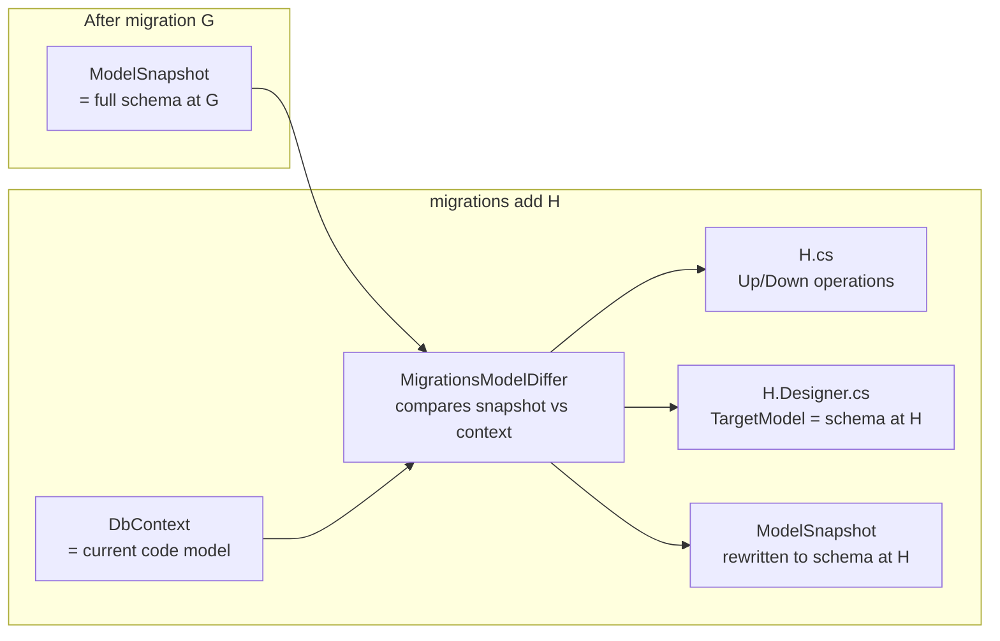
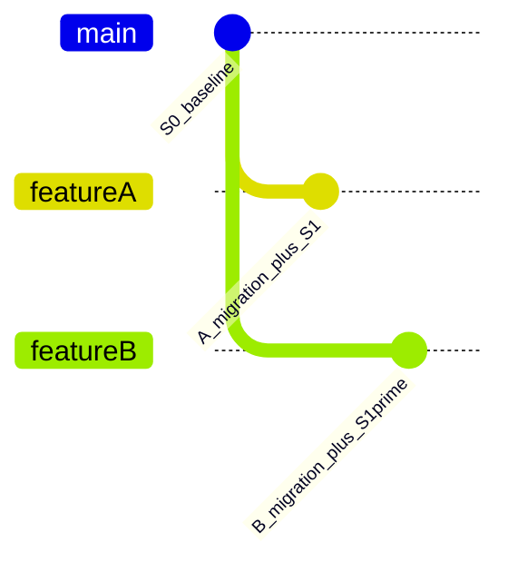

# EF Core migrations: study & reading guide

Onboarding guide for senior engineers who know git, databases, and ORMs (Flyway, Liquibase, raw SQL scripts, Hibernate) but have not worked with EF Core Code First migrations. This document explains the mental model behind EF Core migration metadata and why standard git workflows (merge, rebase) break it.

For implementation-level details, see [migration-generation.md](migration-generation.md). For recovery procedures after a bad merge, see [migration-merge-recovery.md](migration-merge-recovery.md).

---

## Reading order

| If you want to… | Read |
|-----------------|------|
| Understand the three migration file types and why git merge/rebase fails | **This guide** |
| See how EF Core generates those files (source-level internals) | [migration-generation.md](migration-generation.md) |
| Recover broken metadata after a bad merge | [migration-merge-recovery.md](migration-merge-recovery.md) |

Suggested sequence: **this guide → generation (optional skim) → merge recovery (when needed)**.

---

## The three files per migration

Running `dotnet ef migrations add <Name>` produces three files:

| File | Role | Analogy |
|------|------|---------|
| `{Id}.cs` | **What changed** — `Up()` and `Down()` methods containing schema operations | A SQL migration script |
| `{Id}.Designer.cs` | **Full schema after this migration** — a frozen copy of the entire model at this point in history | A point-in-time schema dump |
| `{Context}ModelSnapshot.cs` | **Full schema at the tip of the chain** — the baseline for the *next* migration diff | "Current HEAD of the schema history" |

The critical distinction: `.cs` contains a **delta** (add column, create table), while `.Designer.cs` and `ModelSnapshot.cs` each contain a **complete model**. Only one `*ModelSnapshot.cs` exists per `DbContext`, and it is completely rewritten on every new migration.

---

## Which snapshot is used when creating new migrations?

This is the single most important thing to understand. When you run `migrations add`:

1. EF reads exactly **one file**: `{Context}ModelSnapshot.cs` — the model it contains becomes the "before" picture.
2. EF builds the "after" picture from the current `DbContext` class at design time.
3. EF diffs the two models and generates the `Up()`/`Down()` operations, a new `.Designer.cs`, and a replacement snapshot.

It does **not** diff against old `.Designer.cs` files. It does **not** connect to any live database. The snapshot file is the sole source of truth for "what the schema looked like before this migration."

**Practical implication:** if the snapshot is wrong — due to a bad merge, manual edit, or stale branch — the next `migrations add` will produce incorrect or empty migrations, even when your entity classes are perfectly correct.

---

## What are old `.Designer.cs` files for?

Old Designers are **not** used as the baseline for new migrations. That job belongs exclusively to `ModelSnapshot.cs`.

Each `.Designer.cs` encodes the **TargetModel** for its migration — the complete schema that should exist in the database *after* that migration is applied. EF uses these at **runtime / apply time**:

- The `Migrator` passes `TargetModel` into SQL generation when applying a migration. This means the Designer influences the exact SQL produced, even though the `Up()` method looks self-contained.
- When applying migrations incrementally (e.g. `dotnet ef database update`), each step knows the expected end state for that step via its Designer.
- Only the **last** migration's TargetModel should match the current `DbContext`. Intermediate Designers represent historical schema states.

**"Can't we just delete old Designers?"** — risky. If you ever apply, revert, or generate SQL for intermediate migrations, stale or missing Designers can produce incorrect SQL even when `Up()` looks fine.

---

## Why parallel branches break

Every branch that runs `migrations add` produces its **own full snapshot** at its tip. Two branches with independent migrations = two complete, incompatible models stored in the same file path.

Consider two engineers starting from the same snapshot **S0** on `main`:

- Engineer A adds an `Orders` table. Their `migrations add` diffs S0 against their DbContext, produces `M_A.cs` (add Orders table) and rewrites `ModelSnapshot.cs` to S1 (S0 + Orders).
- Engineer B adds a `Products` table. Their `migrations add` also diffs S0, produces `M_B.cs` (add Products table) and rewrites `ModelSnapshot.cs` to S1' (S0 + Products).

Both `M_A.cs` and `M_B.cs` are individually correct delta scripts. But both branches rewrote `ModelSnapshot.cs` with a complete model that only includes *their* changes. Git now sees one file with two unrelated full models.

---

## Why git rebase does not fix this

Senior engineers often reach for `git rebase` to linearize history. This works well for application code but fundamentally does not work for EF migration metadata.

**What rebase does:** replays commits on a new base. It does **not** re-run `dotnet ef migrations add` or recompute any diffs.

| Problem | Explanation |
|---------|-------------|
| Migrations are **derived artifacts** | `Up()` was generated as `diff(parent_snapshot, author_model)`. Replaying the commit on a different parent snapshot does not regenerate that diff — the operations are still based on the original parent. |
| Snapshot commits are not composable | Rebasing "add migration B" onto a branch that already has "migration A" leaves B's `.cs` still based on S0, while the tree now has S1. The operations and metadata drift apart. |
| Snapshot file still conflicts | Even a "clean" rebase with no textual conflicts can leave a single snapshot that matches neither branch's true cumulative schema. |

**What rebase is good for:** linearizing *application code* (entity classes, DbContext configuration, business logic).

**What it is not good for:** reconciling independently scaffolded migration metadata. After rebasing, the migration `.cs` files still contain operations computed against the wrong parent snapshot.

The Microsoft-recommended approach is different: pick one migration chain, merge entity code, and re-add migrations on the integration branch. See [Managing migrations conflicts](https://aka.ms/efcore-docs-migrations-conflicts).

---

## Why merging snapshot files in git fails

Direct conflict resolution in `ModelSnapshot.cs` or `.Designer.cs` — whether via merge or rebase — almost never produces a valid result.

**Snapshots are coherent object graphs, not independent hunks.** A snapshot's `BuildModel()` method defines entities, properties, keys, indexes, relationships, and annotations as one interconnected structure. Git's line-based merge treats each hunk independently, but these hunks reference each other (foreign keys point to entity names, indexes reference property lists, etc.).

**Merge conflict markers produce invalid C#.** Even if you resolve every `<<<<<<<` marker, the result is unlikely to be a valid `IModel` that EF can load and diff against.

**Picking "ours" or "theirs" drops an entire branch's schema.** The surviving snapshot will not match the merged `DbContext` or the union of all `Up()` scripts.

**Hand-merging two snapshots line-by-line almost never works.** You would need to manually combine two complete model graphs — ensuring no duplicate keys, no orphaned foreign keys, and consistent annotations throughout. This is what `CSharpSnapshotGenerator` does programmatically from an `IModel`, and it produces thousands of lines of output for non-trivial schemas.

The same applies to `.Designer.cs` files after the fork point — each encodes a **full** model, not a delta.

**Rule of thumb:** treat snapshot and Designer conflicts as "do not merge in git" signals. Recover metadata separately using the procedure in [migration-merge-recovery.md](migration-merge-recovery.md) or the `MigrationMetadataRegenerator` tool described there.

---

## Quick reference

| Question | Answer |
|----------|--------|
| Which file does `migrations add` diff against? | `*ModelSnapshot.cs` only — never old Designers or a live database |
| Can I merge two snapshot files in git? | No. Regenerate from a known-good state or use the recovery pipeline. |
| Will rebase replay migrations correctly? | No. Migrations are tied to the snapshot state at generation time; rebase does not re-scaffold. |
| Are old `.Designer.cs` files unused? | Used at apply/SQL generation time. Not used for scaffolding new migrations. |
| What usually survives a bad merge? | `{Id}.cs` (Up/Down) and merged entity code. Usually broken: snapshot and Designers after the fork point. |
| Where do I go to fix broken metadata? | [migration-merge-recovery.md](migration-merge-recovery.md) |

---

## Further reading

- [Managing migrations conflicts](https://aka.ms/efcore-docs-migrations-conflicts) — official EF Core guidance
- [Migrations overview](https://learn.microsoft.com/ef/core/managing-schemas/migrations/) — EF Core docs
- [migration-generation.md](migration-generation.md) — how EF Core scaffolds migration files internally
- [migration-merge-recovery.md](migration-merge-recovery.md) — recovery procedures and the `MigrationMetadataRegenerator` tool
